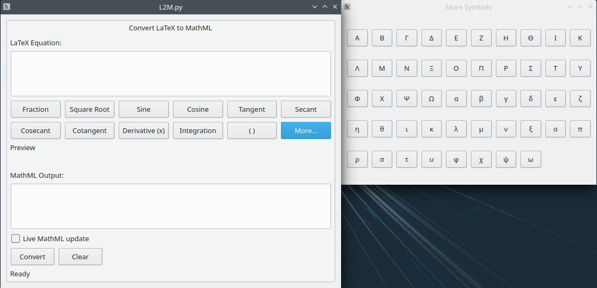
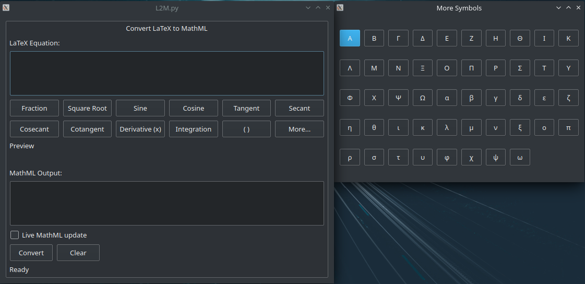

# l2mml
A simple front-end gui for the PyPi latex2mathml library with live preview thanks to sympy. This was written for use by tutors at the Aggie Math Learning Center at Utah State University

Not affiliated with the developers of latex2mathml or sympy

## Command line arguments

There are three command line arguments:

1. `--showlatexoutput`, which shows the output of the `pdfLaTeX` executable when previews are built. Default is `False`
2. `--forceWin`, which if on Linux or Mac, forces the Windows-specific no-live-preview interface.
3. `--forcePosix`, which forces the Linux/MacOS specific interface with live preview allowed.

## Live preview

Thanks to sympy. Is not supported on Windows (well, it's just *super* slow for some reason).

## Installation:

### Linux and MacOS

Make sure you have `pip` and `python` (v3.8+), and run the following commands in the code directory:
```
pip install pyqt5 sympy latex2mathml pyinstaller
chmod +x build.sh
./build.sh
```

### Windows

Again, make sure `pip` and `python` (v3.8+) are installed, and run the following commands:
```
pip install pyqt5 sympy latex2mathml pyinstaller
pyinstaller L2M.py
```

## Screenshots




Note that L2M follows the system theme because it literally just uses Qt's rendering engine. To switch to dark mode (on Linux at least) set your system to dark mode.
